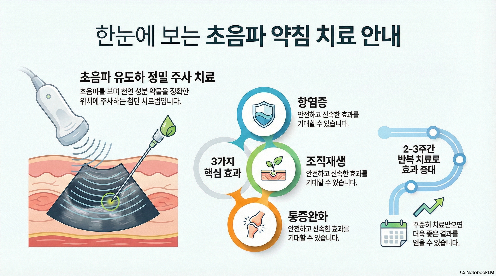
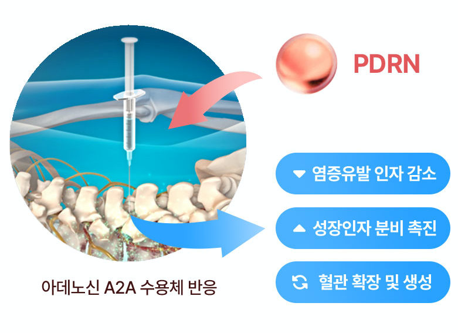

## 🩺 초음파 유도하 PDRN 약침
**손상된 조직의 회복을 돕는 재생 치료**

---

### 1. PDRN 약침이란?
PDRN(Polydeoxyribonucleotide)은 인체 조직과 유사한 DNA 조각 성분을 사용하여, 약해지거나 손상된 **세포와 조직의 자가 회복을 돕는 치료**입니다. 단순히 통증만 줄이는 것이 아니라, 염증 완화와 조직 강화에 도움을 줄 수 있습니다.

본원에서는 **고해상도 초음파**를 통해 병변 부위를 실시간으로 확인하며 약물을 주입하므로, 보다 정밀한 치료가 가능합니다.

---

### 2. 주요 치료 대상 및 원리

**📍 관절 질환 (무릎, 어깨, 고관절 등)**
퇴행성 변화나 염증으로 인해 손상된 관절 부위에 적용합니다. 관절 내 염증 환경을 개선하여 통증을 줄이고, **관절의 기능 회복**을 돕습니다.

**📍 척추 질환 (디스크, 협착증, 만성 요통)**
신경 압박으로 인한 염증 부위나 약해진 척추 주변 인대에 시술합니다. **항염증 작용**을 통해 신경 자극을 줄이고 허리와 목의 안정성을 높이는 데 기여합니다.

**📍 힘줄·인대 손상 (엘보, 족저근막염 등)**
만성적인 염증으로 약해진 힘줄과 인대에 콜라겐 생성을 돕는 물질을 공급합니다. 이를 통해 **조직의 결속력을 강화**하고 튼튼하게 아물도록 유도합니다.

---

### 3. 치료의 특징

* **🔍 정밀성:** 초음파 영상을 통해 혈관과 신경을 피해 필요한 위치에 정확히 주입합니다.
* **🛡️ 생체 적합성:** 인체 유래 성분과 유사하여 거부 반응이나 부작용의 우려가 적습니다.
* **⏱️ 간편함:** 시술 시간이 짧고, 시술 후 즉시 일상생활 복귀가 가능합니다.

---

### 4. 시술 후 주의사항

안전한 회복을 위해 다음 사항을 지켜주세요.

* 시술 당일은 무리한 사용을 피하고 **안정을 취해주세요.**
* 시술 후 2~3일간은 강한 마사지나 사우나는 삼가는 것이 좋습니다.
* 개인의 증상과 호전도에 따라 **주 2~3회 간격으로 반복 치료**가 필요할 수 있습니다.

---

*궁금하신 사항은 언제든지 문의해 주세요*

❓ [Q&A] PDRN 약침, 환자분들이 가장 많이 묻는 질문 4가지

**Q1. 일반 진통주사(뼈주사/스테로이드)와 무엇이 다른가요?** 일명 '뼈주사'로 불리는 스테로이드는 통증을 빠르게 줄여주기도 하지만, 반복해서 맞을 경우 그 효과가 약해지며, 관절이나 힘줄이 약해질 우려가 높습니다. 반면, PDRN 약침은 손상된 조직이 스스로 회복하도록 돕는 성분이기 때문에 인체 부담이 적어 반복 시술이 가능하며 장기적인 관절·인대 강화에 중점을 둔 치료입니다.

**Q2. 몇 번이나 치료받아야 하나요?** 환자분의 증상과 질환의 만성도에 따라 다르지만, 만성 통증의 경우 보통 세포가 재생되고 조직이 안정화되는 기간을 고려하여 주 2회 정도 간격으로 3~4주 정도의 치료를 권장합니다. 의료진의 진단에 따라 치료 횟수와 간격은 조절될 수 있습니다.

**Q3. 시술 시 통증은 어느 정도인가요?** 일반적인 주사를 맞을 때 따끔한 정도와 비슷합니다. 다만, 약물이 병변 부위에 들어갈 때 일시적으로 뻐근한 느낌(압박감)이 들 수 있습니다. 이는 약물이 조직 사이로 퍼지면서 생기는 자연스러운 현상이며, 시술 후 잠시 안정을 취하면 대부분 가라앉습니다.

**Q4. 시술 후 바로 걸어 다녀도 되나요?** 네, 시술 직후 보행이나 운전 등 일상생활은 바로 가능합니다. 다만, 약물이 주입된 부위가 잘 아물 수 있도록 시술 당일에는 무리한 운동이나 무거운 물건을 드는 등 과도한 움직임은 피하고 충분히 휴식하는 것이 회복에 더 도움이 됩니다.

## 네이버예약

https://booking.naver.com/booking/13/bizes/384022
<!--  -->
<!--  -->
<!-- hugo new content content/post/my-first-post/index.md -->

<!-- [Aging Vectors by Vecteezy](https://www.vecteezy.com/free-vector/aging) -->