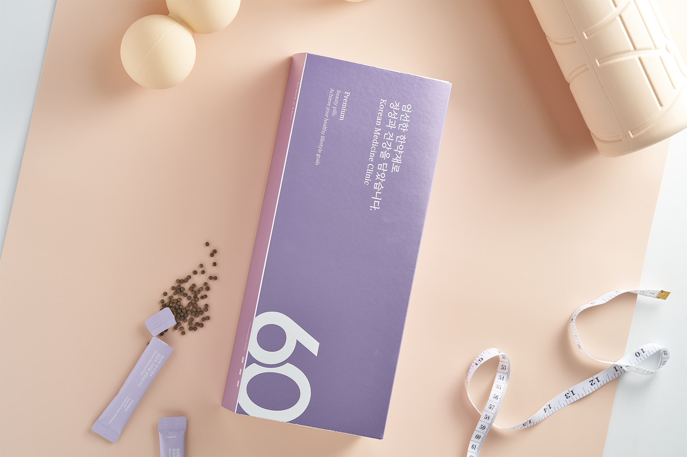

<!--  -->
<!--  -->
<!-- hugo new content content/post/my-first-post.md -->

# 체질개선다이어트의 효과
체질개선다이어트는, 체질개선을 통해 우리 몸의 유산소기능을 강화하며, 효과적으로 체지방을 태우는 몸으로 개선될 수 있도록 합니다.
## 유산소기능 강화
인체대사를 활성화하고 유산소기능을 강화하여 운동 효과를 증폭시킵니다.
## 식욕 억제
식욕을 억제하고 적은 식사량으로도 컨디션을 유지할 수 있도록 합니다.
## 체지방분해 촉진
체지방과 인체내 독소를 제거하며, 지방분해전침과 병행하면 국소부위의 체지방분해를 촉진하는 효과가 있습니다.

- 엄선된 천연 성분으로 매우 안전합니다.
- 일시적인 효과가 아닌 체질개선을 통해 요요현상을 방지합니다!

- 15만원 / 30일 (슬림환)
- 29만원 / 30일 (탕약)
- 81만원 / 90일 (탕약)
*지방분해전침 12회

