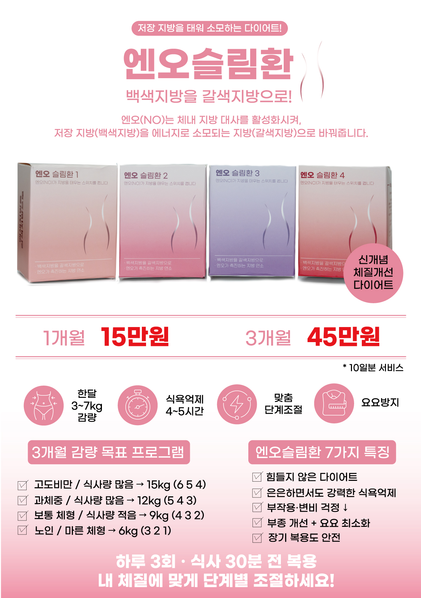

<!--  -->
<!--  -->
<!-- hugo new content content/post/my-first-post.md -->

# 체질개선다이어트의 효과
체질개선다이어트는, 체질개선을 통해 우리 몸의 유산소기능을 강화하며, 효과적으로 체지방을 태우는 몸으로 개선될 수 있도록 합니다.
## 유산소기능 강화
인체대사를 활성화하고 유산소기능을 강화하여 운동 효과를 증폭시킵니다.
## 식욕 억제
식욕을 억제하고 적은 식사량으로도 컨디션을 유지할 수 있도록 합니다.
## 체지방분해 촉진
체지방과 인체내 독소를 제거하며, 지방분해전침과 병행하면 국소부위의 체지방분해를 촉진하는 효과가 있습니다.

- 엄선된 천연 성분으로 매우 안전합니다.
- 일시적인 효과가 아닌 체질개선을 통해 요요현상을 방지합니다!

## 엔오슬림환
굶지 않으면서도, 힘들지 않게, 꾸준히 감량할 수 있는 방법!
엔오슬림환은 단순히 체중을 줄이는 것이 아니라, 몸속의 ‘백색지방(저장 지방)’을 ‘갈색지방(소모 지방)’으로 바꾸어 체질 개선을 돕는 원리로 작용합니다. 쉽게 말해, 에너지를 저장만 하고 쌓이던 지방을 에너지로 태워 쓸 수 있는 지방으로 전환시켜주는 것이죠. 단순히 ‘살이 빠졌다’에 그치지 않고, 대사 개선·지방 분해·식욕 억제라는 세 가지 효과가 함께 나타나기 때문에 건강한 다이어트가 가능합니다.

실제 복용하신 분들의 평균 감량 수치를 보면, 첫 달에는 3 ~ 7kg, 이후 두 번째 달에는 3 ~ 4kg, 세 번째 달에는 2 ~ 3kg 정도로 단계별 감량 효과를 보이는 경우가 많습니다. 단기간의 급격한 변화보다는 꾸준하고 안정적인 감량을 추구한다는 점이 차별화 포인트입니다.

### 엔오슬림환
- 15만원/30일
- 45만원/100일
### 체질개선다이어트 탕약
- 29만원/30일 (탕약)
- 81만원/90일 (탕약)

