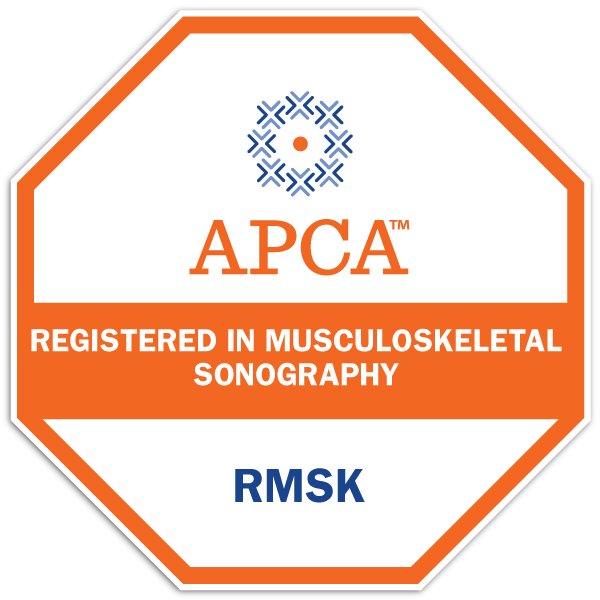

<!--  -->
<!--  -->
<!-- hugo new content content/post/my-first-post.md -->
원장 성기원

전문의 / RMSK / 한의학박사

## 학력
- 경희대학교 한의과대학 졸업
- 경희대학교 한의과대학원 석사/박사학위

## 자격
- 한방전문의  
- RMSK(Registered in Musculoskeletal Sonography) --미국 초음파의사협회 근골격계 인증의

<!--  -->

## 경력
- 전 압구정코편한한의원 대표원장  
- 2009 대한민국고객감동그랑프리 명의부문 대상선정
- 2009 네이버지식인 상담한의사 위촉 
 
## 연구 논문
- Microarray 기법을 이용한 전립선비대 동물모델에서 薑黃의 작용기전 연구・ The Effect of Oral Curcuma longa ingestion on the gene expression in a Rat Model of Benign Prostatic Hyperplasia using microarray analysis. ―-박사학위
- 香砂平胃散으로 호전된 위암으로 인한 위장절제술 後遺症 환자의 臨床證例 보고・ 六味地黃湯 및 補中益氣湯이 Rat의 피부섬유아세포, 사구체메산지움세포 및 혈관내피세포의 老化 遲延에 미치는 影向 ―-석사학위
- 급성기 뇌경색 환자의 두통에 대한 破塞滑血湯의 임상적 효능・ 당뇨를 동반한 중풍환자의 皮膚 瘙痒症에 대한 防風通聖散 투여 2례 등